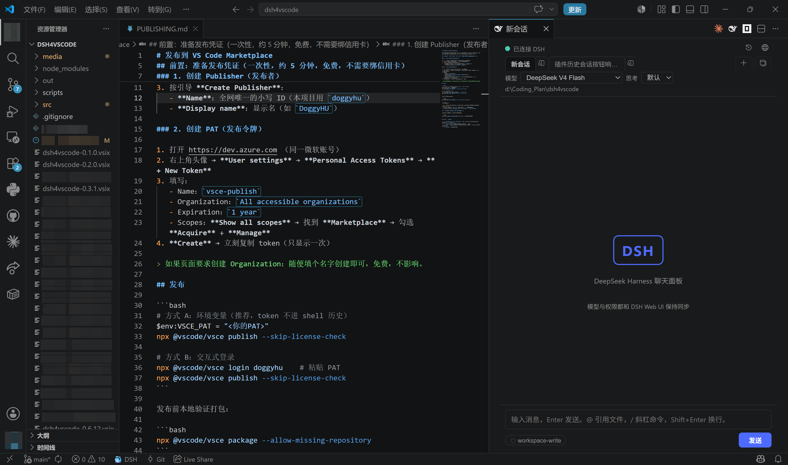
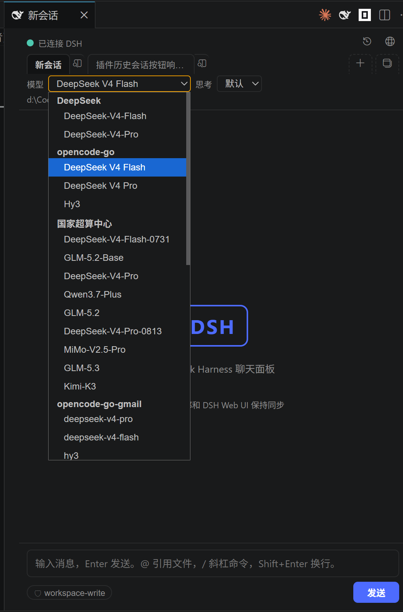
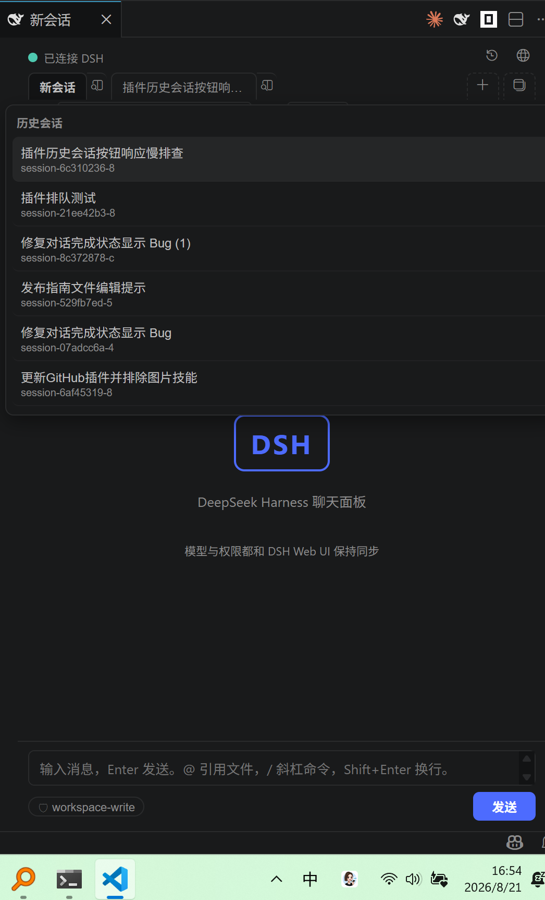

# DSH Chat for VS Code

在 VS Code 里直接用 **DeepSeek Harness（DSH）** 的智能体。这不是一个聊天玩具——聊天面板背后是完整的 DSH agent：它可以读取、创建、修改工作区文件，运行命令，搜索网页，并行委派子任务，然后把每一步工具调用实时展示在聊天流里。

> 参考了 OpenCode / Claude Code / Cline 的 VS Code 插件形态，但**调用的是 DSH 本身**：插件通过 DSH 的 HTTP RPC（`/api/*`）和 WebSocket 事件流（`/api/events.mux`、`/api/events.host`）连接正在运行的 DSH 实例，复用它的全部 agent 能力。

## 截图

编辑器区的独立聊天窗口（OpenCode 式），与代码窗口平级、可拖拽分屏：



模型选择器是 **DSH Web UI 的原样镜像**——列表直接索引 `session.models`，按 provider 分组、显示名、每个模型声明的 effort 档位，选中即调 `session.selectModel`（DSH 自己校验），DSH 加模型/加 provider 插件自动出现：



会话历史**只列当前工作区的会话**，与 DSH Web UI 完全同步（`session.list` 按 `cwd` 过滤，隐藏空占位会话）：



## 特性

- 🪟 **纯编辑器窗口形态（OpenCode 式）**：DSH Chat 是编辑器区里的独立窗口，与代码窗口平级——**每个窗口 = 一个完整的会话工作区**：自带会话 tab 栏、＋新建、🪟再开新窗口、📜历史、模型选择器、问题卡片。窗口想开几个开几个，拖到任意编辑器组分屏并行。
- 🔒 **窗口之间完全独立**：新窗口永远创建**全新的独立会话**（全新上下文），各窗口各聊各的、互不同步；同一窗口内可切换会话 tab。
- 🖥 **入口**：编辑器右上角 💬 按钮 / `Ctrl+Alt+D` / 状态栏 🐳 / 命令 `DSH: New Chat Window`——全部是"开一个独立窗口"。
- 📑 **会话历史 = 当前工作区**：窗口内 📜 按钮列出**当前工作区**（cwd）的全部历史会话，与 DSH Web UI 的会话列表同源同步（`session.list` 过滤同 cwd、隐藏空占位会话），一键切换/继续旧对话。
- ❓ **Agent 提问卡片**：agent 调用 `ask_user_question` 时弹出问题卡片（单选/多选/自定义输入），回答后 agent 继续，不再卡死。
- 🤖 **真正的 agent**：会话绑定当前工作区（`cwd`），DSH 的 `standard` preset 自带文件读写、终端、搜索、子代理等全套工具——让它"直接改文件"，它就真的改。
- 🎛 **模型选择器 = DSH Web UI 的原样镜像**（插件零自有模型逻辑）：
  - 列表直接索引 `session.models`：按 provider 分组、显示名、每个模型声明的 effort 档位——DSH 加模型/加 provider 插件自动出现，无需升级插件
  - 选中即调 `session.selectModel`（DSH 自己校验），effort 下拉按所选模型声明的档位重建
  - **继承跟着 DSH 走**：选一次成为 DSH 部署默认值，新建对话自动继承（插件重启也不丢）
  - 发送时直接 prompt——DSH 用自己的 current 组装本轮，与 Web UI 同一条路径
- 🎯 **选中内容自动附带（Claude Code 同款）**：在编辑器里选中一行/一段文字，直接在聊天里说"把这行替换成 12345"——发送时自动附带选中内容（文件路径、行号、代码块），agent 直接就能看到并改文件，不用再手动粘贴。
- 🛡 **权限模式**：点击底部徽章弹出选择器，或 `Shift+Tab` 循环切换 read-only / workspace-write / full access，与 DSH 会话投影实时同步。
- 💾 **会话持久化**：按工作区复用 DSH 会话，重启 VS Code 后历史自动恢复（恢复最近更新的会话，含关闭前仍在运行的）。
- ⌨ **VS Code 联动**：
  - 编辑器右上角 💬 按钮一键开窗口；选中代码时出现 ❓（解释）和 🐛（修复）按钮
  - 右键选中代码 → 「DSH: Ask About Selection」/「DSH: Debug / Fix Selection」（自动附带文件路径、行号、代码块，并打开新窗口）
  - 输入 `@` 快速引用工作区文件、`/` 提示斜杠命令（compact / plan / goal / permission / echo）
- 🛑 **可取消**：运行中点「停止」，回合状态正确显示「已停止」。

## 前置条件

- 正在运行的 **DSH 实例**（默认 `http://127.0.0.1:3080`）。插件直接连它的 HTTP/WS API——不需要浏览器 GUI 打开，DSH 进程活着即可。
- 模型、provider、凭证全部由 **DSH 侧配置**（Web GUI 的 Models 页或 DSH 配置），插件不保存任何模型配置。

## 安装

### 方式一：VSIX 安装（推荐）

```bash
npm install
npm run compile
npm run package     # 生成 dsh4vscode-<version>.vsix
```

然后在 VS Code 中：扩展面板 → `...` → **Install from VSIX**，选择生成的 `.vsix`。

### 方式二：开发模式（Extension Development Host）

```bash
npm install
npm run compile
code --extensionDevelopmentPath=<本目录>
```

## 配置（settings.json）

| 设置 | 默认 | 说明 |
|---|---|---|
| `dsh.baseUrl` | `http://127.0.0.1:3080` | DSH web 服务器地址 |
| `dsh.workspacePath` | `""` | 覆盖会话 cwd（空 = 第一个工作区文件夹） |
| `dsh.agentPreset` | `standard` | 创建会话使用的 agent preset |

## 架构

```
src/
├── extension.ts          # 入口：命令、状态栏、窗口注册
├── dsh/
│   ├── client.ts         # DSH HTTP RPC (/api/<method>) + WebSocket 双事件流 + 自动重连
│   ├── controller.ts     # 会话管理、回合模型、事件→聊天模型、权限/模型目录索引
│   ├── config.ts         # dsh.* 设置类型化访问
│   └── types.ts          # DSH wire 协议类型（与 packages/host/apiproxy 对齐）
└── webview/
    ├── panel.ts          # 编辑器窗口 + 消息桥 + 选中内容/@文件引用扩展
    └── media/            # 前端：main.js / style.css / vendor/markdown-it.min.js
```

设计原则：**插件是 DSH 的纯索引层**——模型列表、继承、effort 档位、权限、校验全部直通 DSH 原版行为（与 Web UI 同一套 `session.models` / `session.selectModel` / `commands/execute` 契约），DSH 升级时插件自动跟随，不需要维护第二套逻辑。

### 协议要点（DSH web API）

- `POST /api/<method>`：JSON-RPC 信封 `{type:'client-request', rpcId, method, payload}` → `{type:'server-response', result:{ok, value|error}}`
- `ws /api/events.mux`：会话事件流（`session/event`、`session/subscribed`、`approval/*`、`question/*` 等）
- `ws /api/events.host`：宿主状态流（`host/session-status` 运行翻转、`host/session-added` 等）
- 关键方法：`session.list` / `session.create` / `session.history` / `session.prompt` / `session.cancel` / `session.models` / `session.selectModel` / `commands/execute`

## 已知说明

- 开发模式下 VS Code 会提示 "webview without a content security policy"——这是 VS Code 对 webview **初始空 HTML** 的固定提示，本插件实际设置了完整 CSP，仅开发环境可见，可忽略。
- 斜杠命令的返回文本是**可选的**（DSH 命令契约）：`/echo` 这类 void 命令没有返回文本，面板会显示命令"✓ 完成"而无输出。

## License

MIT